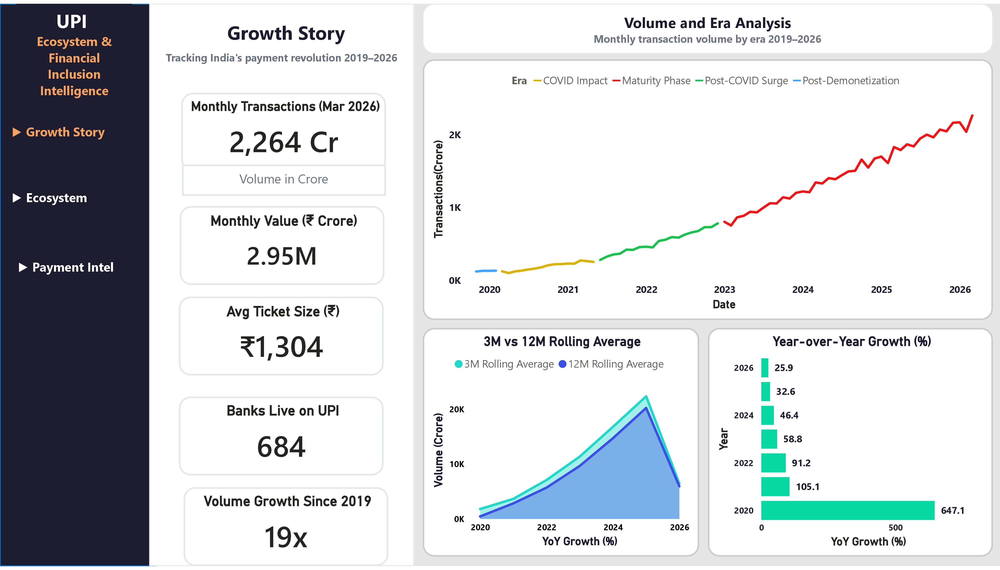
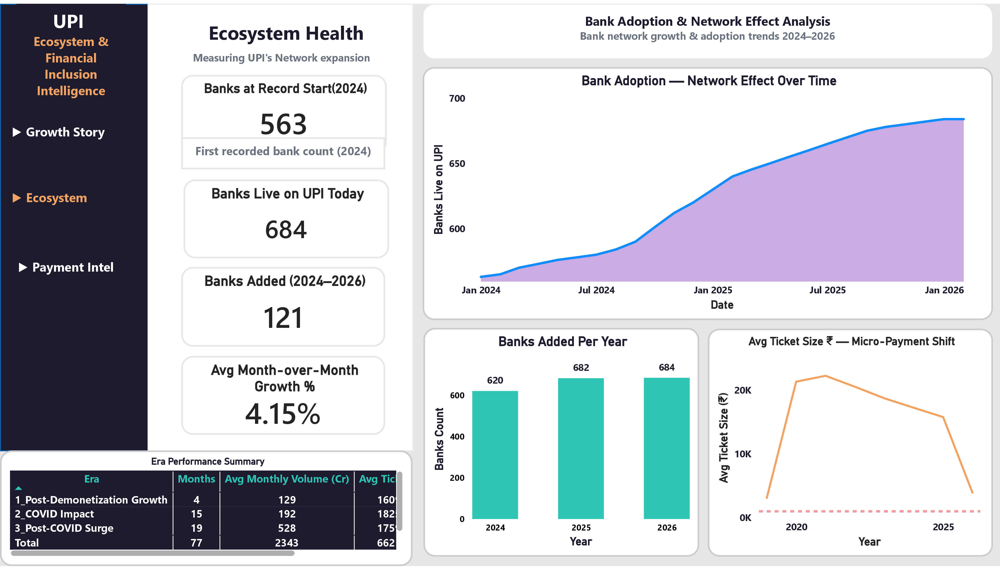
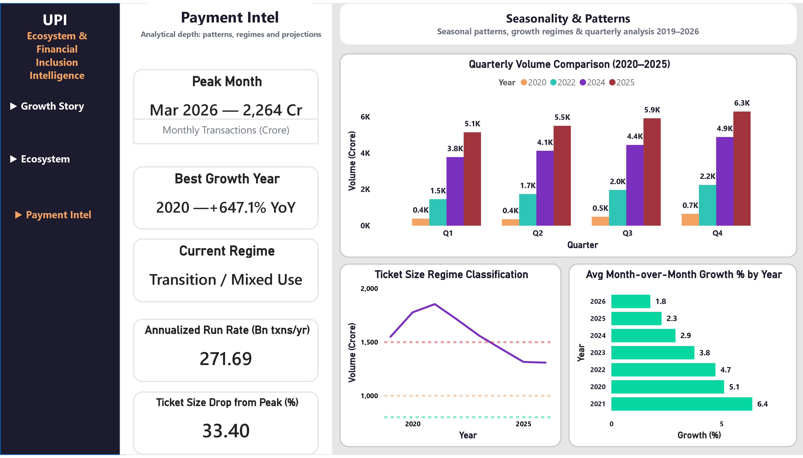
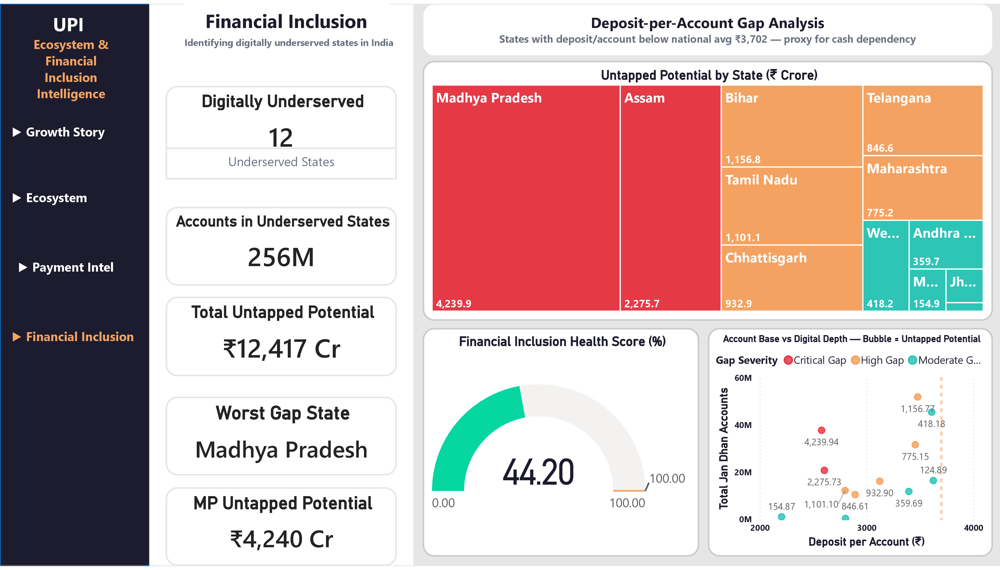

<div align="center">

# 💳 UPI Ecosystem & Financial Inclusion Intelligence

### *India processed more digital payments than the entire US & Europe combined in 2024.*
### *This project shows exactly how that happened.*

<br>

<table width="100%">
<tr>
<td align="center" width="35%">📅<br><b>77 months</b><br><sub>Nov 2019 – Mar 2026</sub></td>
<td align="center" width="35%">🏦<br><b>3 sources</b><br><sub>RBI · NPCI · data.gov.in</sub></td>
<td align="center" width="35%">🔢<br><b>5 queries</b><br><sub>SQL analysis</sub></td>
<td align="center" width="35%">📈<br><b>7 charts</b><br><sub>EDA visualizations</sub></td>
</tr>
</table>

<br>

[](dashboard/screenshots/upi_intelligence.pdf) [](https://drive.google.com/file/d/18-m4b5VCd4hRZ79Ok61hihVL0UtRVPbB/view?usp=sharing)

</div>

<br>

---

## 📸 Dashboard Preview

### 📈 Growth Story — *Volume growth by era*


### 🏦 Ecosystem Health — *Bank network expansion*


### 🧠 Payment Intelligence — *Seasonality & regime shift*


### 🗺️ Financial Inclusion — *State-wise digital gap analysis*


---

## 🗄️ Data Sources

<table>
<tr><td colspan="3" align="center">


</td></tr>
<tr>
<th>Dataset</th><th>Source</th><th>Coverage</th>
</tr>
<tr><td>UPI Monthly Volume & Value</td><td>NPCI via India Data Portal</td><td>Nov 2019 – Mar 2026</td></tr>
<tr><td>UPI P2P vs P2M Breakdown</td><td>NPCI via India Data Portal</td><td>Apr 2020 – Aug 2023</td></tr>
<tr><td>10 Payment Rails (IMPS, NACH, FASTag etc.)</td><td>NPCI Monthly Statistics</td><td>2024</td></tr>
<tr><td>Jan Dhan State-wise Accounts</td><td>data.gov.in</td><td>Latest snapshot, 36 states</td></tr>
</table>

> ⚠️ All data sourced directly from Indian government portals (.csv/.xlsx). No Kaggle. No synthetic data.

---

<div align="center">

## ⚡ The Numbers That Matter

<table>
<tr>
<td align="center" width="12.5%"><h1>19x</h1><b>Volume growth</b><br><sub>Nov 2019 → Mar 2026</sub></td>
<td align="center" width="12.5%"><h1>+647%</h1><b>YoY growth, 2020</b><br><sub>COVID was a catalyst</sub></td>
<td align="center" width="12.5%"><h1>58.5%</h1><b>P2M share, Aug 2023</b><br><sub>Up from 38.4% in 2020</sub></td>
<td align="center" width="12.5%"><h1>271.7Bn</h1><b>Annual run rate</b><br><sub>Transactions / year</sub></td>
</tr>
<tr>
<td align="center"><h1>₹1,304</h1><b>Avg ticket, Mar 2026</b><br><sub>Down from ₹1,959 peak</sub></td>
<td align="center"><h1>684</h1><b>Banks on UPI</b><br><sub>Up from 563 in 2024</sub></td>
<td align="center"><h1>24x</h1><b>UPI vs IMPS volume</b><br><sub>No competition exists</sub></td>
<td align="center"><h1>458.9M</h1><b>Jan Dhan accounts</b><br><sub>₹1.7L Cr in deposits</sub></td>
</tr>
<tr>
<td align="center"><h1>₹12,417 Cr</h1><b>Untapped potential</b><br><sub>Across 12 underserved states</sub></td>
<td align="center"><h1>255.9M</h1><b>Accounts below avg</b><br><sub>55.8% of all Jan Dhan</sub></td>
<td align="center"><h1>44.2%</h1><b>Inclusion health score</b><br><sub>States above national avg</sub></td>
<td align="center"><h1>₹3,702</h1><b>National avg deposit</b><br><sub>Per Jan Dhan account</sub></td>
</tr>
</table>

</div>

---

## 🔍 5 Findings That Tell the Real Story

###  🦠 COVID Was a Launchpad, Not a Setback

> Everyone expected COVID to kill digital payments. The data says **+647% YoY in 2020.**

When lockdowns hit, Indians stopped using cash overnight. Avg ticket size **peaked at ₹1,959 in Jun 2020** — people were moving rent, bulk groceries, and family funds digitally. UPI didn't just survive COVID, it used it as a growth engine.

---

###  🏪 The Merchant Revolution Nobody Talks About

> UPI started as a way to split bills. It's now India's primary retail payment rail.

```
Apr 2020  ████████████████░░░░░░░░░░░░░░  38.4%
Aug 2023  ████████████████████████░░░░░░  58.5%
```

Growth ran **~3-4pp per year**, then **jumped 10pp in 2023 alone.** Every chai shop, kirana store, and petrol pump is now a UPI merchant.

---

###  📉 Falling Ticket Size = Rising Adoption (Counterintuitive)

> The avg transaction value is falling. That's actually the best sign possible.

| Era | Period | Avg Ticket |
|:---|:---|:---:|
| Post-Demonetization Growth | Nov 2019 – Feb 2020 | ₹1,609 |
| COVID Impact | Mar 2020 – May 2021 | **₹1,825** 🔺 peak |
| Post-COVID Surge | Jun 2021 – Dec 2022 | ₹1,759 |
| Maturity Phase | Jan 2023 – Mar 2026 | ₹1,428 🔻 |

Ticket dropped **₹655 in 3 years** because millions of ₹50 tea payments entered the system. That's not decline — that's mass adoption.

---

###  🏆 There Is No Competition

> IMPS is India's second-largest payment rail. UPI does IMPS's **entire annual volume in one month.**

| Payment Rail | 2024 Annual Volume |
|:---|---:|
| IMPS | 5,938 Mn |
| NETC (FASTag) | 4,059 Mn |
| NACH APBS | 3,219 Mn |
| **UPI (monthly avg)** | **~14,350 Mn** |

UPI is **24x IMPS.** The Indian retail payments race ended years ago.

---

###  📊 Year-over-Year — Moderating but Still Massive

> Growth % is slowing. Absolute growth is not.

| Year | Total Volume | YoY Growth |
|:---:|---:|:---|
| 2019 (2 mo) | 253 Cr | — |
| 2020 | 1,888 Cr | 🟢 **+647.1%** |
| 2021 | 3,873 Cr | 🟢 +105.1% |
| 2022 | 7,404 Cr | 🟢 +91.2% |
| 2023 | 11,761 Cr | 🟢 +58.9% |
| 2024 | 17,221 Cr | 🟢 +46.4% |
| 2025 | 22,828 Cr | 🟢 +32.6% |

UPI still adds **~5,000 Crore transactions annually** in absolute terms. Maturing ≠ slowing.

---

###  🗺️ The Financial Inclusion Gap — Where UPI Hasn't Reached Yet

> 458.9 Million Jan Dhan accounts exist. But 55.8% of them are in states still operating below the national average deposit level.

Using deposit-per-account as a proxy for digital payment adoption, 12 states fall below the national average of ₹3,702/account — meaning financially included but still cash-dependent.

| State | Deposit/Account | Gap vs National Avg | Untapped Potential |
|:---|:---:|:---:|---:|
| Madhya Pradesh | ₹2,579 | ₹1,123 below | **₹4,240 Cr** |
| Assam | ₹2,605 | ₹1,097 below | **₹2,276 Cr** |
| Bihar | ₹3,479 | ₹223 below | **₹1,157 Cr** |
| Tamil Nadu | ₹2,800 | ₹902 below | ₹1,101 Cr |
| Chhattisgarh | ₹3,124 | ₹578 below | ₹933 Cr |
| 7 more states | — | — | ₹2,710 Cr |

**Total: ₹12,417 Crore** in untapped deposit potential across 255.9M accounts. These are the next billion UPI users.

---

## 🛠️ Tech Stack

**Languages**


**Data, BI & Visualization**


**Database**


---

## 🏗️ How It Was Built

```
📥 RAW DATA          🔧 PYTHON PIPELINE        🗄️ POSTGRESQL         📊 POWER BI
─────────────        ──────────────────        ──────────────        ──────────
RBI Excel       →    01_clean_engineer    →    upi_monthly      →    Growth Story
NPCI CSVs       →    02_eda_charts        →    upi_p2p_p2m      →    Ecosystem
Jan Dhan CSV    →    03_load_postgres     →    npci_products    →    Payment Intel
13 files total  →    04_sql_queries       →    jan_dhan         →    Financial Inclusion
                →    05_inclusion_gap     →    inclusion_gap    →    4-page report
                →    export_powerbi       →    6 SQL queries    →    Live dashboard
```

### 📁 Project Structure

```
upi-payment-intelligence/
├── 📂 data/raw/                ← 13 original government source files
├── 📂 data/processed/          ← Cleaned CSVs + SQL outputs + Power BI exports
├── 📂 notebooks/charts/        ← 7 EDA charts (PNG)
├── 📂 dashboard/screenshots/   ← 3 Power BI page exports
├── 📂 sql/
│   ├── 01_upi_growth_trend.sql
│   ├── 02_p2p_vs_p2m_shift.sql
│   ├── 03_bank_adoption_rate.sql
│   ├── 04_payment_mode_comparison.sql
│   ├── 05_ticket_size_era_analysis.sql
|   └── 06_financial_inclusion_gap.sql
├── 🐍 00_setup.py              ← Environment verification
├── 🐍 01_clean_engineer.py     ← Cleaning + feature engineering (77 rows → 18 features)
├── 🐍 02_eda_visualizations.py ← 7 production charts
├── 🐍 03_load_postgres.py      ← PostgreSQL loader (4 tables)
├── 🐍 04_run_sql_queries.py    ← 5 SQL analytical queries
├── 🐍 05_financial_inclusion_gap.py ← gap analysis + chart 8
├── 🐍 06_run_inclusion_analysis.py  ← loads to PostgreSQL + SQL 6
└── 🐍 export_for_powerbi.py    ← Power BI CSV exporter (6 files)
```

<details>
<summary><b>⚙️ Reproduce This Project</b></summary>

```bash
git clone https://github.com/yourusername/upi-payment-intelligence
cd upi-payment-intelligence
pip install -r requirements.txt

python 00_setup.py                 # ✓ verify environment & files
python 01_clean_engineer.py        # ✓ clean + engineer 18 features
python 02_eda_visualizations.py    # ✓ generate 7 EDA charts
python 03_load_postgres.py         # ✓ load 4 tables to PostgreSQL
python 04_run_sql_queries.py       # ✓ run 5 SQL queries
python export_for_powerbi.py       # ✓ export 6 Power BI CSVs
```

</details>

---

<div align="center">

**Built on Verified Government Data by Shariq Mukadam**

*If this repo helped you, give it a ⭐*

</div>